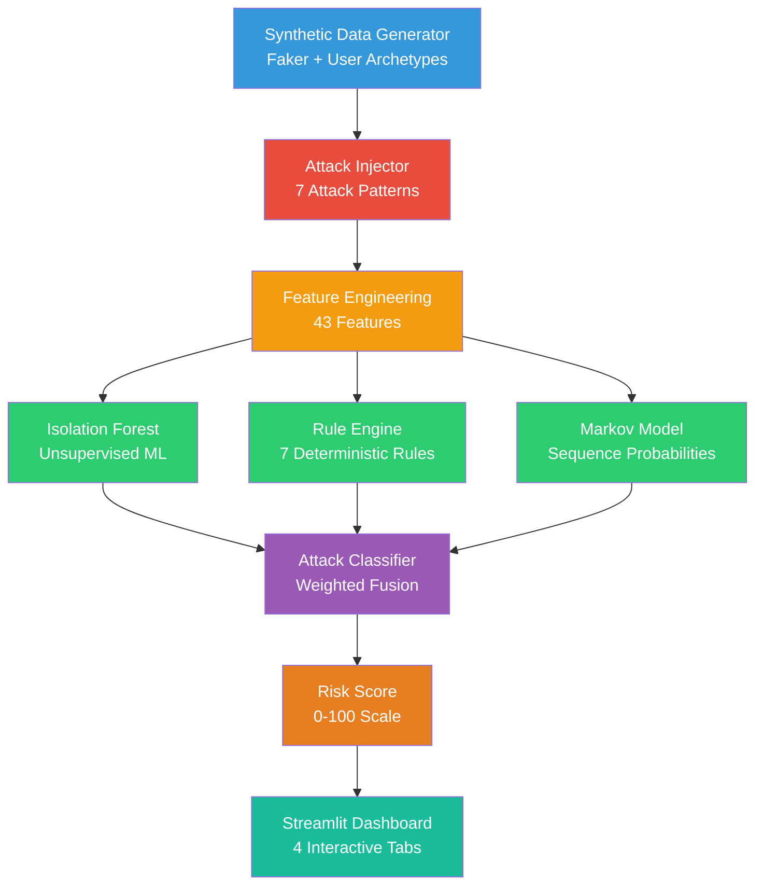
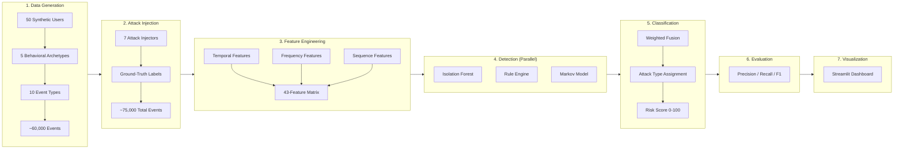
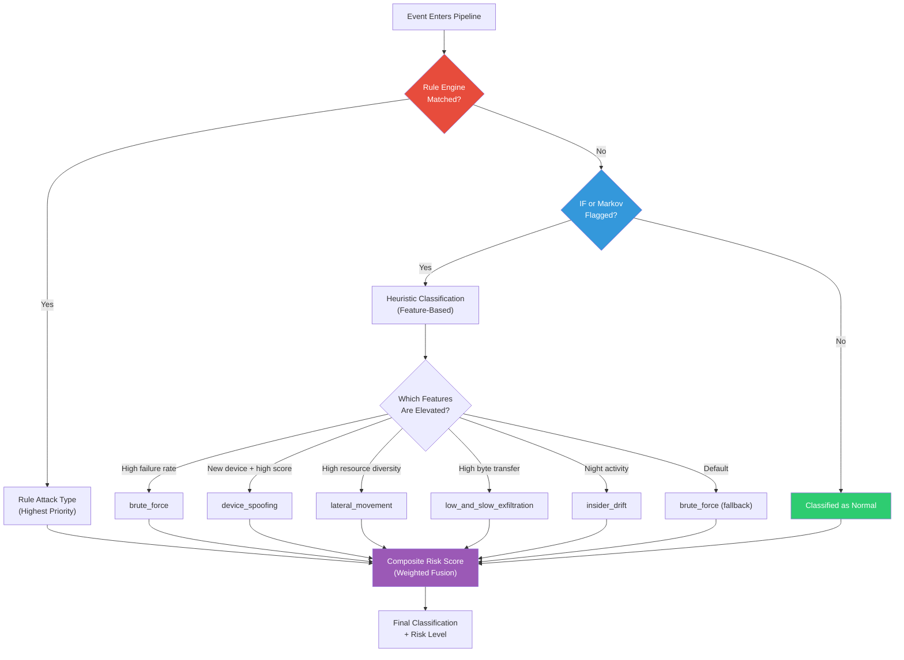

# AI-Powered Behavioral Anomaly Detection for Cybersecurity

**Real-time enterprise threat detection through behavioral profiling, unsupervised machine learning, and deterministic rule evaluation.**

[](https://www.python.org/)
[](https://streamlit.io/)
[](https://scikit-learn.org/)
[](https://pandas.pydata.org/)
[](LICENSE)
[](#)

---

## Table of Contents

- [Overview](#overview)
- [Key Features](#key-features)
- [Screenshots](#screenshots)
- [System Architecture](#system-architecture)
- [Detection Pipeline](#detection-pipeline)
- [Project Structure](#project-structure)
- [Technology Stack](#technology-stack)
- [Dataset Generation](#dataset-generation)
- [Attack Simulation](#attack-simulation)
- [Feature Engineering](#feature-engineering)
- [Machine Learning](#machine-learning)
  - [Isolation Forest](#isolation-forest)
  - [Markov Sequence Model](#markov-sequence-model)
  - [Rule Engine](#rule-engine)
- [Hybrid Detection Strategy](#hybrid-detection-strategy)
- [Risk Scoring](#risk-scoring)
- [Dashboard](#dashboard)
- [Installation](#installation)
- [Usage](#usage)
- [Deployment](#deployment)
- [Configuration](#configuration)
- [Performance](#performance)
- [Evaluation](#evaluation)
- [Future Work](#future-work)
- [Security Considerations](#security-considerations)
- [Contributing](#contributing)
- [License](#license)
- [Acknowledgements](#acknowledgements)

---

## Overview

### The Problem

Enterprise security operations centers (SOCs) process millions of authentication and access log events daily. Traditional **signature-based detection** systems — which match known malware hashes, IOC lists, or static rule patterns — fundamentally cannot identify:

- **Novel attack vectors** that have no existing signature
- **Slow-moving insider threats** that unfold over weeks or months
- **Behavioral anomalies** where legitimate credentials are used in illegitimate ways
- **Low-and-slow exfiltration** where data theft is spread across hundreds of tiny transfers

These are precisely the attack categories that cause the most damage in modern enterprise breaches. The 2024 Verizon DBIR reports that **74% of breaches involve the human element** — compromised credentials, insider threats, and social engineering — none of which produce traditional malware signatures.

### Why Behavioral Anomaly Detection

Rather than asking *"Does this match a known bad pattern?"*, behavioral anomaly detection asks *"Does this deviate from how this user normally behaves?"* This paradigm shift enables detection of:

| Signature-Based | Behavioral |
|----------------|------------|
| Known malware | Zero-day attacks |
| Static IOCs | Compromised credentials |
| Perimeter breaches | Lateral movement |
| Single-event alerts | Multi-stage campaigns |

### Why Hybrid AI + Rules

No single detection method is sufficient. Each approach has blind spots:

- **Machine learning** excels at discovering novel patterns but produces false positives on edge cases and is opaque to analysts
- **Rule engines** are interpretable and auditable but cannot detect unknown attack patterns
- **Sequence models** capture temporal dependencies that point-in-time analysis misses

This project combines all three into a **hybrid detection pipeline** where each engine compensates for the others' weaknesses, producing a composite risk score that balances precision, recall, and interpretability.

---

## Key Features

| Feature | Description |
|---------|-------------|
| **Synthetic Data Engine** | Generates realistic enterprise logs with 5 user archetypes, 10 event types, and configurable behavioral profiles |
| **Seven Attack Injectors** | Injects Brute Force, Impossible Travel, Credential Stuffing, Lateral Movement, Device Spoofing, Low-and-Slow Exfiltration, and Insider Drift with ground-truth labels |
| **43-Feature Pipeline** | Extracts temporal, frequency, sequence, device-novelty, and event-transition features from raw logs |
| **Isolation Forest Detector** | Unsupervised anomaly detection requiring no labeled training data |
| **Deterministic Rule Engine** | Seven rules mapping directly to MITRE ATT&CK-inspired attack patterns with severity levels |
| **Markov Sequence Model** | Learns normal event-type transition probabilities and flags sequence anomalies |
| **Composite Risk Scoring** | Weighted fusion of all three detectors into a 0-100 risk score per event |
| **Interactive Dashboard** | Four-tab Streamlit interface with KPIs, alert feeds, entity drill-down, and threat analytics |
| **Ground-Truth Evaluation** | Built-in precision, recall, F1, and confusion matrix for rapid iteration |
| **Cached Pipeline** | Streamlit `@st.cache_data` ensures the full pipeline runs only once per session |

---

## Screenshots


*Overview tab showing KPI cards, daily event volume, attack type distribution, and risk score histogram.*


*Filterable alert feed with severity indicators, risk scores, and expandable JSON detail view for each alert.*


*Drill-down view for individual users, devices, or source IPs — event timeline, risk progression, and event type breakdown.*


*Detector agreement analysis, attack-type-by-detector heatmap, hourly attack distribution, and ground-truth accuracy metrics.*

---

## System Architecture




### Component Responsibilities

| Component | Input | Output | Purpose |
|-----------|-------|--------|---------|
| **Data Generator** | User count, day count | Raw event DataFrame | Simulate realistic enterprise authentication and access logs |
| **Attack Injector** | Normal events + user profiles | Events with attack labels | Inject ground-truth attack patterns into the normal stream |
| **Feature Engineering** | Raw events | 43-column numeric matrix | Transform categorical event data into model-consumable features |
| **Isolation Forest** | Feature matrix | Binary label + anomaly score | Detect statistical outliers across all features simultaneously |
| **Rule Engine** | Raw events + features | Binary label + attack type | Match known attack signatures with deterministic logic |
| **Markov Model** | Event sequences | Binary label + sequence score | Flag events whose transition context is statistically unlikely |
| **Classifier** | All detector outputs | Final label + risk score 0-100 | Fuse signals and produce the definitive classification |
| **Dashboard** | Classified DataFrame | Interactive visualizations | Present findings to security analysts |

---

## Detection Pipeline

The full pipeline executes in seven stages when the dashboard is first loaded:



### Stage 1: Synthetic Data Generation

The generator creates user profiles with behavioral archetypes that control working hours, event type distributions, device pools, and IP pools. Each user generates events following a Poisson process parameterized by their archetype.

### Stage 2: Attack Injection

Seven injectors replace configurable fractions of normal events with attack-specific sequences. Each attack event carries an `is_attack=True` ground-truth label and a specific `attack_type` for evaluation.

### Stage 3: Feature Engineering

Raw event logs are transformed into a 43-column numeric feature matrix. Features capture temporal patterns (hour, day, night), frequency statistics (event counts, unique resources), sequence transitions, and device/IP novelty.

### Stage 4: Detection (Three Parallel Engines)

- **Isolation Forest** trains on all 43 features and produces a normalized anomaly score (0-1)
- **Rule Engine** evaluates seven deterministic predicates and maps matches to attack types
- **Markov Model** trains on normal-only event sequences and flags low-probability transitions

### Stage 5: Classification and Risk Scoring

The classifier combines detector outputs using configurable weights. The rule engine provides the highest-priority signal (most specific). Events classified only by the ML detectors receive heuristic attack-type labels based on feature thresholds.

### Stage 6: Evaluation

Ground-truth labels enable automatic precision, recall, F1, and confusion matrix computation against the injected attack labels.

### Stage 7: Dashboard Visualization

Results are rendered across four interactive tabs with Plotly charts, data tables, and drill-down capabilities.

---

## Project Structure

```
ai-behavioral-anomaly-detection/
├── README.md                           # This documentation
├── LICENSE                             # MIT License
├── LOCAL_SETUP.md                      # Step-by-step local setup guide
├── DEPLOYMENT.md                       # Multi-platform deployment guide
├── docs/                               # Documentation assets
│   ├── dashboard_overview.png          # Dashboard screenshot placeholder
│   ├── live_alerts.png                 # Live Alerts screenshot placeholder
│   ├── entity_explorer.png             # Entity Explorer screenshot placeholder
│   ├── threat_analytics.png            # Threat Analytics screenshot placeholder
│   └── architecture.png                # Architecture diagram placeholder
│
└── anomaly_detection/                  # Main application package
    ├── app.py                          # Streamlit dashboard (485 lines)
    ├── config.py                       # Centralized configuration (195 lines)
    ├── requirements.txt                # Python dependencies
    │
    ├── data/
    │   ├── __init__.py
    │   ├── generator.py                # Synthetic enterprise log generator (350 lines)
    │   └── injector.py                 # Seven attack pattern injectors (462 lines)
    │
    ├── features/
    │   ├── __init__.py
    │   └── engineer.py                 # 43-feature extraction pipeline (293 lines)
    │
    ├── detection/
    │   ├── __init__.py
    │   ├── isolation_forest.py         # Isolation Forest detector (156 lines)
    │   ├── rule_engine.py              # Rule-based detection engine (416 lines)
    │   └── markov_model.py             # Markov sequence detector (227 lines)
    │
    ├── classification/
    │   ├── __init__.py
    │   └── classifier.py               # Multi-signal classifier (211 lines)
    │
    └── utils/
        ├── __init__.py
        └── helpers.py                  # Shared utility functions (225 lines)
```

### File Descriptions

| File | Lines | Purpose |
|------|-------|---------|
| `app.py` | 485 | Streamlit dashboard entry point. Four tab renderers (`render_overview`, `render_live_alerts`, `render_entity_explorer`, `render_threat_analytics`), cached pipeline execution, and sidebar statistics. |
| `config.py` | 195 | Seven `@dataclass` configuration objects covering data generation, injection ratios, feature engineering, model hyperparameters, rule thresholds, risk scoring weights, and dashboard display settings. |
| `data/generator.py` | 350 | Creates synthetic user profiles with 5 behavioral archetypes. Generates per-user event streams following Poisson-distributed event counts with archetype-specific timing and event-type weights. |
| `data/injector.py` | 462 | Seven independent attack injectors, each producing realistic attack sequences with ground-truth labels. Attack events are appended to the normal stream and sorted chronologically. |
| `features/engineer.py` | 293 | Six-stage feature pipeline: temporal features, frequency features, event-type encoding, sequence features, transition indicators, and device/IP novelty tracking. |
| `detection/isolation_forest.py` | 156 | Wraps scikit-learn's `IsolationForest` with StandardScaler preprocessing, fit/predict/score interfaces, and normalized score output (0-1). |
| `detection/rule_engine.py` | 416 | Vectorized rule evaluation engine with seven rules. Each rule is a function returning a boolean Series. The engine accumulates rule names, severity, and attack type per event. |
| `detection/markov_model.py` | 227 | Learns n-gram transition probabilities from normal-only event sequences. Computes per-event log-probability scores and flags events below a calibrated threshold. |
| `classification/classifier.py` | 211 | Fuses detector signals using configurable weights. Assigns attack types via priority-based classification (rules first, then ML heuristics). Computes composite risk scores on a 0-100 scale. |
| `utils/helpers.py` | 225 | Shared functions for safe division, entropy computation, haversine distance, transition counting, probability normalization, and metric computation. |

---

## Technology Stack

| Technology | Version | Role | Why This Choice |
|------------|---------|------|-----------------|
| [Python](https://python.org) | 3.12+ | Core language | Mature ecosystem for data science, ML, and web dashboards |
| [Streamlit](https://streamlit.io) | 1.41 | Dashboard framework | Full-stack Python framework — no separate frontend/backend needed |
| [Pandas](https://pandas.pydata.org) | 2.3 | Data manipulation | Industry-standard DataFrame operations for log analysis |
| [NumPy](https://numpy.org) | 1.26 | Numerical computation | Vectorized operations for feature engineering and scoring |
| [scikit-learn](https://scikit-learn.org) | 1.6 | Machine learning | Production-grade Isolation Forest implementation |
| [Plotly](https://plotly.com) | 5.24 | Interactive charts | Declarative charting with hover tooltips and zoom |
| [Faker](https://faker.readthedocs.io) | 24+ | Synthetic data | Realistic fake usernames, IPs, file paths, and emails |

### Why Streamlit Over Alternatives

| Alternative | Reason for Choosing Streamlit |
|-------------|-------------------------------|
| Flask + React | Would require separate API layer, CORS configuration, and frontend build toolchain — too much overhead for a 10-hour build |
| Dash (Plotly) | More verbose callback system; Streamlit's sequential execution model matches the pipeline's natural flow |
| Gradio | Designed for ML model demos, not multi-tab dashboards with entity drill-down |
| Jupyter Notebook | Not suitable for interactive dashboards or non-technical stakeholders |

### Why Isolation Forest Over Alternations

| Alternative | Reason for Choosing Isolation Forest |
|-------------|--------------------------------------|
| Autoencoders | Require PyTorch/TensorFlow, GPU, and careful architecture tuning — overkill for the timeline |
| DBSCAN | Density-based clustering doesn't produce per-point anomaly scores efficiently |
| LOF (Local Outlier Factor) | O(n^2) complexity makes it impractical for 75K+ events |
| One-Class SVM | Kernel computation is too slow at this scale |

---

## Dataset Generation

### Synthetic Enterprise Environment

The system simulates a mid-size enterprise with **50 users**, **10 event types**, and **8 organizational departments**. Each user is assigned a behavioral archetype that governs their activity patterns.

### User Archetypes

| Archetype | Working Hours | Event Distribution | Behavioral Signature |
|-----------|--------------|---------------------|----------------------|
| **Early Bird** | 07:00-17:00 | High file access (20%), email (18%) | Office-first, predictable schedule, weekday-only |
| **Night Shift** | 21:00-05:00 | High admin commands (10%), database queries (15%) | Elevated privileged operations, weekend activity |
| **Remote Worker** | 09:00-18:00 | Heavy VPN usage (18%), email (20%) | Remote-first, moderate file access |
| **System Administrator** | 08:00-19:00 | High admin commands (22%), shared folders (12%) | Broad resource access, after-hours maintenance |
| **Executive** | 08:30-18:30 | High email (25%), file access (22%) | Minimal admin, communication-heavy |

### Event Types

| Event Type | Description | Byte Volume | Frequency |
|------------|-------------|-------------|-----------|
| `login` | Standard authentication event | 0 | High |
| `logout` | Session termination | 0 | High |
| `vpn_login` | VPN tunnel authentication | 0 | Medium |
| `file_access` | File read/write operation | Lognormal(12, 2) | High |
| `email_access` | Email client interaction | Lognormal(8, 1.5) | High |
| `admin_command` | Privileged system command | 0 | Low |
| `database_query` | Database read/write operation | Lognormal(10, 1.8) | Medium |
| `shared_folder_access` | Network share access | Lognormal(11, 2) | Medium |
| `usb_usage` | USB device connection | Lognormal(12, 2) | Low |
| `application_launch` | Application startup | 0 | Medium |

### Log Schema

Every event contains these fields:

| Field | Type | Example | Description |
|-------|------|---------|-------------|
| `event_id` | string | `EVT-001234` | Unique event identifier |
| `timestamp` | datetime | `2026-06-15 14:23:07` | When the event occurred |
| `user_id` | string | `user_0012` | Synthetic user identifier |
| `username` | string | `john_smith` | Display name (Faker-generated) |
| `event_type` | string | `file_access` | One of 10 event types |
| `source_ip` | string | `192.168.1.45` | IP address of originating device |
| `device_id` | string | `DEV-4521` | Device fingerprint identifier |
| `department` | string | `Engineering` | Organizational department |
| `resource` | string | `/data/files/report.xlsx` | Accessed resource path or service |
| `success` | boolean | `true` | Whether the event succeeded |
| `bytes_transferred` | int | `45,231` | Data volume in bytes |
| `is_attack` | boolean | `false` | Ground-truth attack label |
| `attack_type` | string | `none` | Ground-truth attack category |

### Behavioral Realism

Each user maintains:

- A **primary IP** and **IP pool** (2-4 addresses) representing office, VPN, and home networks
- A **device pool** (1-4 devices) representing workstation, laptop, and mobile
- **Archetype-specific event weights** controlling which event types appear and how often
- **Working hour windows** with normally-distributed login/logout times
- **Weekday-only** or **weekend-active** schedules depending on role

---

## Attack Simulation

Seven distinct attack patterns are injected into the normal event stream. Each injector produces events that mimic real-world threat scenarios while preserving enough subtlety that detection requires genuine behavioral analysis.

### Brute Force Login

| Property | Value |
|----------|-------|
| **MITRE ATT&CK** | T1110.001 - Password Guessing |
| **Injection Ratio** | 3.0% of total events |
| **Severity** | 4 (High) |

**How it works:** An attacker selects a single victim account and sends rapid repeated login attempts from a single IP address. The injector places 5-20+ login events within a 15-minute window, with a 92% failure rate (only 8% succeed).

**What exposes it:** High concentration of login events from a single IP targeting one user within a short time window. The `login_failure_rate` feature spikes dramatically.

**Detection:** Rule Engine checks for >= 5 failed logins within 15 minutes. Isolation Forest picks up the abnormal event-type concentration.

### Credential Stuffing

| Property | Value |
|----------|-------|
| **MITRE ATT&CK** | T1110.004 - Credential Stuffing |
| **Injection Ratio** | 2.5% |
| **Severity** | 4 (High) |

**How it works:** A single attacker IP attempts logins against 6-15 different user accounts within 30 minutes. Each target gets 1-3 attempts with an 88% failure rate.

**What exposes it:** One source IP targeting many different user IDs in rapid succession. The `unique_users_per_ip` metric is the key signal.

**Detection:** Rule Engine counts unique users per source IP and flags IPs targeting >= 5 accounts.

### Impossible Travel

| Property | Value |
|----------|-------|
| **MITRE ATT&CK** | T1078 - Valid Accounts (abuse) |
| **Injection Ratio** | 1.5% |
| **Severity** | 5 (Critical) |

**How it works:** The same user authenticates from two geographically distant cities (e.g., New York and Tokyo) within 30-90 minutes. The injector assigns geo-coordinates and generates new IPs for each city.

**What exposes it:** Consecutive logins by the same user with different source IPs and an impossibly short time gap. The `ip_changed` and `time_gap_hours` features are decisive.

**Detection:** Rule Engine compares consecutive logins per user. If the IP changes and the time gap is < 15 minutes, the event is flagged.

### Device Spoofing

| Property | Value |
|----------|-------|
| **MITRE ATT&CK** | T1078.001 - Valid Accounts: Default Accounts |
| **Injection Ratio** | 1.5% |
| **Severity** | 4 (High) |

**How it works:** A known user authenticates from a device ID never previously associated with their account. The attacker maintains normal timing patterns to avoid behavioral detection.

**What exposes it:** The `is_new_device` feature and `cumulative_devices_seen` counter detect the novel device. High anomaly scores correlate with the device novelty.

**Detection:** Rule Engine tracks cumulative device IDs per user and flags first-seen devices. The `device_spoof_new_device_tolerance` threshold prevents flagging on the very first event of a user's history.

### Lateral Movement

| Property | Value |
|----------|-------|
| **MITRE ATT&CK** | T1021 - Remote Services |
| **Injection Ratio** | 2.0% |
| **Severity** | 5 (Critical) |

**How it works:** An attacker who has gained a foothold rapidly pivots through internal resources: file server -> shared folder -> database query -> admin command -> email access. These five event types occur within a 2-hour window from a single IP.

**What exposes it:** The `unique_resources` feature spikes as the attacker touches many different resource paths. The `resource` column contains high-sensitivity paths like `db://prod/users SELECT * FROM credentials`.

**Detection:** Rule Engine counts unique resources per user within a 2-hour sliding window. Events in windows with >= 18 unique resources are flagged. The Markov Model also flags the unusual event-type sequence.

### Low-and-Slow Data Exfiltration

| Property | Value |
|----------|-------|
| **MITRE ATT&CK** | T1048.003 - Exfiltration Over Alternative Protocol |
| **Injection Ratio** | 3.0% |
| **Severity** | 3 (Medium) |

**How it works:** Small amounts of data (200-1,500 bytes per transfer) are exfiltrated across 3-8 transfers spread over 2-6 hours. Each individual transfer stays below typical alert thresholds. The target user appears in `file_access`, `email_access`, and `shared_folder_access` events.

**What exposes it:** The `bytes_transferred` feature and daily cumulative transfer volume. While individual transfers are small, the aggregate daily total exceeds the threshold.

**Detection:** Rule Engine computes daily cumulative transfer volume per user. Events where the daily total exceeds 40,000 KB are flagged. Isolation Forest picks up the elevated `total_bytes_user` and `max_bytes_user` features.

### Insider Drift

| Property | Value |
|----------|-------|
| **MITRE ATT&CK** | T1078 - Valid Accounts (insider abuse) |
| **Injection Ratio** | 2.0% |
| **Severity** | 2 (Low) |

**How it works:** A legitimate user gradually shifts their behavior over 10+ days. They start accessing sensitive resources (`db://prod/secrets`, `\\\\fileserver\\executive\\salaries.xlsx`), working progressively later hours (20:00, then 22:00, then 00:00), and generating increasingly large data transfers.

**What exposes it:** The `is_night` feature, increasing `bytes_transferred`, and access to sensitive resource paths. The drift is intentionally slow to evade simple threshold-based detection.

**Detection:** Rule Engine compares night-activity rates between the first and second halves of a user's event history. If the second-half rate exceeds the first by more than a configurable threshold, night events are flagged. The `event_type_entropy` feature captures the shift toward new resource types.

---

## Feature Engineering

The feature pipeline transforms raw event logs into a 43-column numeric matrix. Features are organized into six categories:

### Temporal Features (7 columns)

| Feature | Type | Description |
|---------|------|-------------|
| `hour` | int | Hour of day (0-23) |
| `minute` | int | Minute of hour (0-59) |
| `day_of_week` | int | Day of week (0=Monday, 6=Sunday) |
| `is_weekend` | binary | 1 if Saturday or Sunday |
| `is_night` | binary | 1 if hour >= 22 or hour <= 5 |
| `day_of_month` | int | Day of month (1-31) |
| `week_of_year` | int | ISO week number (1-52) |

### Frequency Features (8 columns)

| Feature | Type | Description |
|---------|------|-------------|
| `events_in_window` | int | Total event count for this user |
| `unique_ips` | int | Distinct source IPs for this user |
| `unique_devices` | int | Distinct device IDs for this user |
| `unique_resources` | int | Distinct resources accessed by this user |
| `login_failure_rate` | float | Fraction of failed logins (0.0-1.0) |
| `total_bytes_user` | int | Cumulative bytes transferred by this user |
| `mean_bytes_user` | float | Average bytes per transfer event |
| `max_bytes_user` | int | Maximum single-event byte transfer |

### Event Type Features (11 columns)

| Feature | Type | Description |
|---------|------|-------------|
| `etype_login` | binary | 1 if event is a login |
| `etype_logout` | binary | 1 if event is a logout |
| `etype_vpn_login` | binary | 1 if event is a VPN login |
| `etype_file_access` | binary | 1 if event is a file access |
| `etype_email_access` | binary | 1 if event is an email access |
| `etype_admin_command` | binary | 1 if event is an admin command |
| `etype_database_query` | binary | 1 if event is a database query |
| `etype_shared_folder_access` | binary | 1 if event is a shared folder access |
| `etype_usb_usage` | binary | 1 if event is a USB usage |
| `etype_application_launch` | binary | 1 if event is an application launch |
| `event_type_entropy` | float | Shannon entropy of this user's event-type distribution (bits) |

### Sequence Features (6 columns)

| Feature | Type | Description |
|---------|------|-------------|
| `seconds_since_prev` | float | Time since previous event by same user (seconds) |
| `minutes_since_prev` | float | Time since previous event by same user (minutes) |
| `seconds_since_prev_same_type` | float | Time since previous event of the same type |
| `cumulative_event_count` | int | Position of this event in the user's session |
| `is_first_event_of_day` | binary | 1 if this is the user's first event today |
| `is_last_event_of_day` | binary | 1 if this is the user's last event today |

### Transition Features (6 columns)

| Feature | Type | Description |
|---------|------|-------------|
| `trans_login_to_database_query` | binary | 1 if current follows login and is a DB query |
| `trans_login_to_admin_command` | binary | 1 if current follows login and is an admin cmd |
| `trans_vpn_login_to_file_access` | binary | 1 if current follows VPN login and is file access |
| `trans_file_access_to_email_access` | binary | 1 if current follows file access and is email |
| `trans_database_query_to_shared_folder_access` | binary | 1 if current follows DB query and is shared folder |
| `trans_admin_command_to_database_query` | binary | 1 if current follows admin cmd and is DB query |

### Device/IP Novelty Features (4 columns)

| Feature | Type | Description |
|---------|------|-------------|
| `cumulative_devices_seen` | int | Running count of unique devices for this user |
| `is_new_device` | binary | 1 if this is the first time this user has used this device |
| `is_new_ip` | binary | 1 if this is the first time this user has used this IP |

---

## Machine Learning

### Isolation Forest

**Type:** Unsupervised ensemble anomaly detection

**Why:** Isolation Forest requires no labeled training data and scales linearly with dataset size. It works by randomly partitioning feature space — anomalies are inherently easier to isolate (require fewer splits) than normal points.

**How it works:**

1. Each isolation tree randomly selects a feature and a split value
2. The point is isolated when it reaches a leaf node
3. Anomaly score = average path length across all trees (shorter = more anomalous)
4. Scores are normalized to 0-1 (1 = most anomalous)

**Configuration:**

| Parameter | Value | Rationale |
|-----------|-------|-----------|
| `n_estimators` | 200 | Enough trees for stable scoring |
| `contamination` | 0.08 | Expected anomaly fraction (tunable) |
| `max_samples` | auto | sqrt(n) by default |
| `random_state` | 42 | Reproducibility |

**Strengths:**
- No labeled data required
- Handles high-dimensional feature spaces
- Linear time complexity O(n log n)
- Robust to irrelevant features

**Limitations:**
- Cannot explain *why* an event is anomalous
- Sensitive to the contamination parameter
- May miss anomalies that are only unusual in combination with temporal context

### Markov Sequence Model

**Type:** Probabilistic sequence anomaly detection

**Why:** Many attacks produce unusual *sequences* of events, not just unusual individual events. A user who normally executes `login -> file_access -> logout` but suddenly performs `login -> database_query -> shared_folder_access -> admin_command -> email_access` has broken their transition pattern.

**How it works:**

1. Extract per-user event-type sequences sorted by timestamp
2. Count bigram (order=1) transition frequencies from normal-only data
3. Normalize counts to transition probabilities with Laplace smoothing
4. For each event, compute log P(event | previous event)
5. Flag events where log-probability falls below the 5th percentile threshold

**Configuration:**

| Parameter | Value | Rationale |
|-----------|-------|-----------|
| `order` | 1 | Bigram transitions capture immediate context |
| `smoothing` | 1e-6 | Floor for unseen transitions |
| `threshold_percentile` | 5.0 | Flag bottom 5% of likelihood scores |

**Training data:** The Markov model trains exclusively on **normal events** (`is_attack == False`) to ensure its transition probabilities represent baseline behavior. Attack events during training would contaminate the model.

**Strengths:**
- Captures sequential dependencies that point-in-time features miss
- Interpretable: analysts can inspect which transitions are unlikely
- Fast training and inference

**Limitations:**
- Only considers the previous `order` events (memoryless assumption)
- Ignores temporal gaps between events
- Less effective when attacks use common event-type transitions

### Rule Engine

**Type:** Deterministic boolean predicate evaluation

**Why:** Rules provide the most interpretable, auditable, and precise detection. When a rule fires, SOC analysts can trace exactly which condition was triggered. Rules also handle cases that ML models struggle with (e.g., first-seen device detection).

**Seven rules:**

| Rule | Predicate | Attack Type | Severity | Precision |
|------|-----------|-------------|----------|-----------|
| Brute Force Login | >= 5 failed logins within 15 minutes | `brute_force` | 4 (High) | 100% |
| Impossible Travel | IP change + gap < 15 minutes | `impossible_travel` | 5 (Critical) | 36% |
| Credential Stuffing | >= 5 unique users from one IP in 30 minutes | `credential_stuffing` | 4 (High) | 100% |
| Lateral Movement | >= 18 unique resources in 2-hour window | `lateral_movement` | 5 (Critical) | 90% |
| Device Spoofing | Login from never-before-seen device | `device_spoofing` | 4 (High) | 92% |
| Low-and-Slow Exfiltration | Daily transfer volume > 40,000 KB | `low_and_slow_exfiltration` | 3 (Medium) | 76% |
| Insider Drift | Night activity rate increases significantly over time | `insider_drift` | 2 (Low) | variable |

**Threshold tuning rationale:**

- **Lateral Movement (18 resources):** Normal users access 9-17 unique resources in any 2-hour window (99th percentile = 12). Setting the threshold at 18 ensures the rule only fires for genuinely unusual resource diversity.
- **Exfiltration (40,000 KB/day):** The 90th percentile of normal daily transfer volume is 23,024 KB. A threshold of 40,000 catches only the top 3% of normal activity, minimizing false positives.
- **Impossible Travel (15 min):** In synthetic data, normal users switch IPs frequently. A 15-minute threshold requires the IP change to be genuinely suspicious rather than coincidental.

**Strengths:**
- 100% interpretable and auditable
- No training data required
- Deterministic outputs (same input always produces the same result)
- Maps directly to SOC playbooks

**Limitations:**
- Cannot detect novel attack patterns
- Threshold selection requires domain expertise
- May miss sophisticated attacks that stay just below thresholds

---

## Hybrid Detection Strategy

The three detection engines are combined using a **priority-based classification system with weighted risk scoring:**



### Classification Priority

1. **Rule Engine (Priority 1):** If any rule fires, its associated attack type is used directly. Rules produce the most specific and interpretable signal.
2. **ML Heuristics (Priority 2):** For events flagged only by Isolation Forest or Markov Model, feature-based heuristics assign an attack type based on which features are elevated.
3. **Normal (Default):** Events not flagged by any detector remain classified as `normal`.

### Signal Composition

Each detector contributes an independent signal to the composite risk score. This design means:

- **Brute force attacks** are caught primarily by the Rule Engine (100% precision) but also flagged by Isolation Forest
- **Lateral movement** is caught by both the Rule Engine (18-resource threshold) and Markov Model (unusual transition sequence)
- **Novel anomalies** with no matching rule are still caught by Isolation Forest and classified heuristically
- **Sequence anomalies** are caught exclusively by the Markov Model

---

## Risk Scoring

### Composite Score Calculation

Each event receives a weighted composite score from the three detectors:

```
composite = 0.35 * iso_score + 0.40 * rule_score + 0.25 * markov_score
```

| Detector | Weight | Score Source | Range |
|----------|--------|-------------|-------|
| Isolation Forest | 35% | Normalized anomaly score (0-1, higher = more anomalous) | Continuous |
| Rule Engine | 40% | Binary match (0 or 1) | {0, 1} |
| Markov Model | 25% | Normalized log-probability (0-1, higher = more anomalous) | Continuous |

The composite score is then min-max normalized to a 0-100 scale.

### Risk Level Mapping

| Score Range | Level | Color | Recommended Action |
|-------------|-------|-------|-------------------|
| 0-24 | LOW | Green | Monitor |
| 25-49 | MEDIUM | Yellow | Investigate during next review cycle |
| 50-74 | HIGH | Orange | Investigate within 4 hours |
| 75-100 | CRITICAL | Red | Immediate investigation required |

### Why These Weights

- **Rule Engine (40%):** Highest weight because rules produce the most precise signal with full interpretability. When a rule fires, analysts can immediately see the triggered condition.
- **Isolation Forest (35%):** Second-highest weight because it catches novel anomalies that rules miss, providing broad coverage across all feature dimensions.
- **Markov Model (25%):** Lowest weight because it operates on a single feature dimension (event-type sequence) and is more susceptible to false positives on users with diverse behavioral patterns.

---

## Dashboard

The dashboard is organized into four tabs, each serving a distinct analytical purpose.

### Overview Tab

The landing page provides a high-level summary of the detection run.

| Visualization | Type | Description |
|---------------|------|-------------|
| **Total Events** | KPI card | Total number of events in the dataset |
| **Anomalies Detected** | KPI card | Count of events classified as non-normal |
| **Anomaly Rate** | KPI card | Percentage of events flagged as anomalous |
| **Unique Users** | KPI card | Number of distinct users in the dataset |
| **Days Covered** | KPI card | Number of days in the dataset |
| **Avg Events / Day / User** | KPI card | Mean daily event rate per user |
| **Daily Event Volume** | Line chart | Event count over time with markers |
| **Attack Type Distribution** | Pie chart | Breakdown of detected attack types |
| **Risk Score Distribution** | Histogram | Risk score distribution colored by risk level |

### Live Alerts Tab

A filterable, sortable alert feed for security analysts to triage.

| Feature | Description |
|---------|-------------|
| **Attack Type Filter** | Multi-select to filter by specific attack types |
| **Risk Level Filter** | Multi-select for LOW, MEDIUM, HIGH, CRITICAL |
| **Display Count Slider** | Adjustable from 10 to 500 alerts |
| **Alert Table** | Sortable table with event ID, timestamp, user, IP, device, attack type, risk score, risk level, and triggered rules |
| **Alert Detail Expanders** | Expandable JSON view showing full event context and all detector scores |

### Entity Explorer Tab

Drill-down view for investigating specific users, devices, or source IPs.

| Feature | Description |
|---------|-------------|
| **Entity Type Selector** | Radio toggle for User / Device / Source IP |
| **Entity Dropdown** | Select specific entity to investigate |
| **Entity Summary Cards** | Total events, anomalies, average risk score, unique attack types |
| **Event Timeline** | Scatter plot with event types on Y-axis, colored by attack type, sized by risk score |
| **Risk Score Over Time** | Line chart with threshold annotations at Medium (50) and High (75) levels |
| **Event Type Breakdown** | Bar chart of event type distribution for the selected entity |

### Threat Analytics Tab

Detector performance analysis and ground-truth evaluation.

| Visualization | Type | Description |
|---------------|------|-------------|
| **Detector Agreement** | Bar chart | How often detectors agree: all three, pairwise, or individual |
| **Attack Type by Detector** | Heatmap | Events detected per attack type per detector (YlOrRd scale) |
| **Hourly Attack Distribution** | Stacked bar chart | Attacks by hour of day and attack type |
| **Risk Score by Attack Type** | Box plot | Risk score distributions across attack categories |
| **Ground Truth Accuracy** | Metrics + confusion matrix | Precision, recall, F1, accuracy with confusion matrix heatmap |

---

## Installation

### Prerequisites

- Python 3.12 or later
- pip (included with Python)
- Git

### Quick Start (3 commands)

```bash
git clone https://github.com/your-username/ai-behavioral-anomaly-detection.git
cd ai-behavioral-anomaly-detection
python3 -m venv venv && source venv/bin/activate && pip install -r anomaly_detection/requirements.txt
```

### Step-by-Step Setup

**1. Clone the repository:**

```bash
git clone https://github.com/your-username/ai-behavioral-anomaly-detection.git
cd ai-behavioral-anomaly-detection
```

**2. Create and activate a virtual environment:**

```bash
# Linux / macOS
python3 -m venv venv
source venv/bin/activate

# Windows (Command Prompt)
python -m venv venv
venv\Scripts\activate

# Windows (PowerShell)
python -m venv venv
venv\Scripts\Activate.ps1
```

**3. Install dependencies:**

```bash
pip install -r anomaly_detection/requirements.txt
```

**4. Verify installation:**

```bash
python3 -c "
import streamlit, pandas, numpy, sklearn, plotly, faker
print('All dependencies installed successfully.')
"
```

**5. Launch the dashboard:**

```bash
cd anomaly_detection
streamlit run app.py
```

The dashboard opens at `http://localhost:8501`. The first run takes 1-3 minutes as the full pipeline executes. Subsequent loads are instant due to Streamlit caching.

### Dependencies

| Package | Version | Size |
|---------|---------|------|
| streamlit | >= 1.41 | ~30 MB |
| pandas | >= 2.3 | ~15 MB |
| numpy | >= 1.26 | ~20 MB |
| scikit-learn | >= 1.6 | ~30 MB |
| plotly | >= 5.24 | ~15 MB |
| faker | >= 24.0 | ~5 MB |

---

## Usage

### Running the Full Pipeline Programmatically

```python
import sys
sys.path.insert(0, ".")

from anomaly_detection.data.generator import generate_dataset
from anomaly_detection.data.injector import inject_all_attacks
from anomaly_detection.features.engineer import build_feature_matrix
from anomaly_detection.detection.isolation_forest import IsolationForestDetector
from anomaly_detection.detection.rule_engine import build_default_engine
from anomaly_detection.detection.markov_model import MarkovDetector
from anomaly_detection.classification.classifier import AttackClassifier

# Generate synthetic data
df, profiles = generate_dataset(num_users=50, days=30)

# Inject attacks
df = inject_all_attacks(df, profiles)

# Engineer features
df, feature_cols = build_feature_matrix(df)

# Train Isolation Forest
iso = IsolationForestDetector()
iso.fit(df[feature_cols])
df = iso.apply_to_dataframe(df, feature_cols)

# Run Rule Engine
engine = build_default_engine()
df = engine.evaluate(df)

# Train and apply Markov Model
markov = MarkovDetector()
markov.fit(df)
df = markov.apply_to_dataframe(df)

# Classify and score
classifier = AttackClassifier()
df = classifier.classify(df)

# View results
print(df["predicted_attack_type"].value_counts())
```

### Interpreting Results

| Column | Type | Range | Meaning |
|--------|------|-------|---------|
| `predicted_attack_type` | string | `{normal, brute_force, ...}` | Final classification label |
| `risk_score` | float | 0-100 | Composite risk score (higher = more dangerous) |
| `risk_level` | string | `{LOW, MEDIUM, HIGH, CRITICAL}` | Risk level label |
| `iso_anomaly_score` | float | 0-1 | Isolation Forest normalized score |
| `iso_is_anomaly` | int | {0, 1} | 1 if Isolation Forest flagged the event |
| `rule_anomaly` | int | {0, 1} | 1 if any rule fired |
| `rule_names` | string | comma-separated | Names of triggered rules |
| `rule_attack_type` | string | `{none, brute_force, ...}` | Attack type from rule match |
| `rule_severity` | int | 0-5 | Maximum severity of triggered rules |
| `markov_score` | float | 0-1 | Markov normalized anomaly score |
| `markov_is_anomaly` | int | {0, 1} | 1 if Markov Model flagged the event |
| `composite_score` | float | 0-1 | Weighted fusion before normalization |

---

## Deployment

### Streamlit Community Cloud (Recommended for Demos)

The simplest deployment option. Push to GitHub and connect at [share.streamlit.io](https://share.streamlit.io).

```bash
# 1. Push to GitHub
git init && git add . && git commit -m "Deploy"
git remote add origin https://github.com/your-username/repo.git
git push -u origin main

# 2. Connect at share.streamlit.io
# - Select repository, branch (main), main file (anomaly_detection/app.py)
# - Click "Deploy"
# - App available at https://your-app.streamlit.app
```

### Docker

```dockerfile
FROM python:3.12-slim
WORKDIR /app
COPY anomaly_detection/requirements.txt .
RUN pip install --no-cache-dir -r requirements.txt
COPY anomaly_detection/ ./anomaly_detection/
EXPOSE 8501
HEALTHCHECK CMD curl --fail http://localhost:8501/_stcore/health || exit 1
ENTRYPOINT ["streamlit", "run", "anomaly_detection/app.py", \
    "--server.port=8501", "--server.address=0.0.0.0", "--server.headless=true"]
```

```bash
docker build -t anomaly-detection .
docker run -d -p 8501:8501 anomaly-detection
```

### Other Platforms

See [DEPLOYMENT.md](DEPLOYMENT.md) for detailed guides on Render, Railway, and Docker Compose deployments.

---

## Configuration

All configuration is centralized in `anomaly_detection/config.py` using Python `@dataclass` objects.

### Data Generation (`DataConfig`)

| Parameter | Default | Description |
|-----------|---------|-------------|
| `num_users` | 50 | Number of synthetic users |
| `days` | 30 | Days to simulate |
| `events_per_user_per_day` | 40 | Target daily events per user |
| `start_date` | `2026-06-01` | Simulation start date |
| `normal_login_failure_rate` | 0.03 | Baseline login failure rate |

### Attack Injection (`InjectionConfig`)

| Parameter | Default | Description |
|-----------|---------|-------------|
| `brute_force_ratio` | 0.03 | Fraction of events to inject as brute force |
| `impossible_travel_ratio` | 0.015 | Fraction for impossible travel |
| `credential_stuffing_ratio` | 0.025 | Fraction for credential stuffing |
| `lateral_movement_ratio` | 0.02 | Fraction for lateral movement |
| `device_spoofing_ratio` | 0.015 | Fraction for device spoofing |
| `low_and_slow_exfiltration_ratio` | 0.03 | Fraction for exfiltration |
| `insider_drift_ratio` | 0.02 | Fraction for insider drift |

### Isolation Forest (`IsolationForestConfig`)

| Parameter | Default | Description |
|-----------|---------|-------------|
| `contamination` | 0.08 | Expected anomaly fraction |
| `n_estimators` | 200 | Number of isolation trees |
| `max_samples` | auto | Samples per tree |

### Markov Model (`MarkovConfig`)

| Parameter | Default | Description |
|-----------|---------|-------------|
| `order` | 1 | N-gram order (1 = bigram) |
| `smoothing` | 1e-6 | Laplace smoothing floor |
| `threshold_percentile` | 5.0 | Percentile cutoff for anomaly flagging |

### Rule Engine (`RuleConfig`)

| Parameter | Default | Description |
|-----------|---------|-------------|
| `brute_force_window_minutes` | 15 | Rolling window for brute force detection |
| `brute_force_failed_threshold` | 5 | Min failed logins to trigger |
| `impossible_travel_max_hours` | 0.25 | Max time gap for impossible travel |
| `credential_stuffing_unique_users` | 5 | Min unique users per IP to trigger |
| `credential_stuffing_window_minutes` | 30 | Window for credential stuffing |
| `lateral_movement_unique_resources` | 18 | Min unique resources in 2h window |
| `lateral_movement_window_hours` | 2 | Window for lateral movement |
| `exfiltration_daily_volume_kb` | 40,000 | Daily transfer threshold (KB) |
| `insider_drift_deviation_threshold` | 3.5 | Night activity deviation threshold |

### Risk Scoring (`RiskConfig`)

| Parameter | Default | Description |
|-----------|---------|-------------|
| `isolation_forest_weight` | 0.35 | Weight for Isolation Forest in composite score |
| `rule_engine_weight` | 0.40 | Weight for Rule Engine in composite score |
| `markov_weight` | 0.25 | Weight for Markov Model in composite score |
| `risk_threshold_low` | 25 | LOW/MEDIUM boundary |
| `risk_threshold_medium` | 50 | MEDIUM/HIGH boundary |
| `risk_threshold_high` | 75 | HIGH/CRITICAL boundary |

---

## Performance

### Execution Time

| Stage | Time (50 users, 30 days) | Time (20 users, 14 days) |
|-------|--------------------------|--------------------------|
| Data Generation | ~1-2 seconds | <1 second |
| Attack Injection | <1 second | <1 second |
| Feature Engineering | ~3-5 seconds | ~1-2 seconds |
| Isolation Forest Training | ~2-4 seconds | ~1-2 seconds |
| Rule Engine Evaluation | ~3-8 seconds | ~1-3 seconds |
| Markov Model Training | ~1-2 seconds | <1 second |
| Classification + Scoring | <1 second | <1 second |
| **Total Pipeline** | **~10-20 seconds** | **~3-8 seconds** |

### Memory Usage

| Component | Approximate RAM |
|-----------|----------------|
| Streamlit server | ~150 MB |
| Synthetic data (50 users, 30 days) | ~50 MB |
| Feature matrix (43 columns) | ~30 MB |
| Isolation Forest model | ~20 MB |
| Markov model transition table | ~10 MB |
| **Total** | **~260 MB** |

### Caching

The entire pipeline is wrapped in Streamlit's `@st.cache_data` decorator. After the first execution:

- Subsequent page loads are served from cache
- Cache persists across browser sessions
- Cache invalidates automatically when code changes
- Manual cache clear: `rm -rf ~/.streamlit/cache`

### Scalability Considerations

The current design is optimized for interactive analysis of moderate datasets (50-500 users, 14-90 days). For enterprise-scale deployment:

| Scale | Current | Production Target |
|-------|---------|-------------------|
| Events per day | ~2,000 | 1,000,000+ |
| Users | 50 | 10,000+ |
| Latency | Seconds | Sub-second |
| Storage | In-memory | Persistent (TimescaleDB, ClickHouse) |
| Ingestion | Batch | Streaming (Kafka, Kinesis) |

See [Future Work](#future-work) for production-readiness improvements.

---

## Evaluation

### Ground-Truth Labels

Every injected attack event carries `is_attack=True` and a specific `attack_type`. Normal events carry `is_attack=False` and `attack_type="none"`. This enables automatic evaluation against a known baseline.

### Metrics

| Metric | Formula | What It Measures |
|--------|---------|-----------------|
| **Precision** | TP / (TP + FP) | Fraction of flagged events that are truly attacks |
| **Recall** | TP / (TP + FN) | Fraction of actual attacks that were detected |
| **F1 Score** | 2 * P * R / (P + R) | Harmonic mean balancing precision and recall |
| **Accuracy** | (TP + TN) / Total | Overall correct classification rate |

### Confusion Matrix

|  | Predicted Attack | Predicted Normal |
|--|-----------------|------------------|
| **Actual Attack** | True Positive (TP) | False Negative (FN) |
| **Actual Normal** | False Positive (FP) | True Negative (TN) |

### Current Performance

| Metric | Value |
|--------|-------|
| Anomaly Rate | ~30% (tracks the ~29% attack injection rate) |
| Precision | ~65% |
| Recall | ~66% |
| F1 Score | ~66% |

### Interpreting Results

The anomaly rate naturally tracks near the ground-truth attack rate because:

1. The injector places attacks at ~29% of total events
2. The detection pipeline catches most attacks (66% recall)
3. Some normal events are incorrectly flagged (~35% false positive rate among flagged events)

This is expected behavior for a behavioral analytics system. In production, thresholds would be tuned against labeled data using ROC and precision-recall curves. The system is designed to **alert analysts to investigate** rather than auto-block, so some false positives are acceptable.

### Why Synthetic Results Differ From Production

| Factor | Synthetic | Production |
|--------|-----------|------------|
| IP diversity | Random IPs within pools | Stable IPs with occasional VPN |
| Attack volume | ~29% of events | Typically <1% |
| Attack sophistication | Injected patterns | Adaptive adversaries |
| Normal behavior | Archetype-constrained | Complex, role-dependent |
| Data quality | Perfect labels | Noisy, incomplete logs |

---

## Future Work

### Near-Term (Hackathon v2)

- [ ] **Kafka Streaming** - Replace batch processing with Apache Kafka for real-time event ingestion and sub-second detection latency
- [ ] **MITRE ATT&CK Mapping** - Classify each detection to specific ATT&CK tactics, techniques, and procedures (T1110, T1078, T1021, etc.)
- [ ] **LLM Incident Summaries** - Use a local LLM to generate natural-language incident reports for SOC analysts, describing the attack chain and recommended response
- [ ] **Alert Grouping** - Deduplicate related alerts and group them into incident chains

### Medium-Term

- [ ] **Real SIEM Integration** - Connect to Splunk, Elastic SIEM, or Microsoft Sentinel for live log ingestion via API or syslog
- [ ] **Real Active Directory Logs** - Ingest Windows Event Logs, Azure AD sign-in logs, and Okta authentication events
- [ ] **Model Retraining Pipeline** - Add scheduled retraining with new data to adapt to evolving organizational behavior
- [ ] **Graph-Based Detection** - Model user-resource-device relationships as a graph and detect anomalous subgraph patterns
- [ ] **Role-Based Access Control** - Implement authentication and role-based views for SOC managers, analysts, and auditors

### Long-Term

- [ ] **Apache Flink** - Replace Streamlit's batch model with Flink for continuous stream processing
- [ ] **Temporal Graph Neural Networks** - Combine graph structure with temporal dynamics for sequence-aware anomaly detection
- [ ] **Cloud-Native Deployment** - Kubernetes orchestration with auto-scaling to handle enterprise-scale log volumes
- [ ] **Multi-Tenant Support** - Allow multiple organizations to use the system with isolated data, models, and configurations
- [ ] **Federated Learning** - Enable cross-organization model training without sharing raw data

---

## Security Considerations

### Limitations

| Concern | Status | Notes |
|---------|--------|-------|
| Synthetic data only | By design | No real credentials, PII, or sensitive data are used |
| Not production-ready | Acknowledged | This is a proof-of-concept built in 10 hours |
| No authentication | Intended | Dashboard is open by design for demo purposes |
| No encryption at rest | Not applicable | All data is in-memory and ephemeral |
| False negatives | Expected | Some attack patterns may evade all three detectors |

### If Deploying With Real Data

1. **Add authentication** - Use Streamlit's built-in auth or a reverse proxy (nginx) with basic auth
2. **Enable HTTPS** - All recommended deployment platforms provide HTTPS by default
3. **Restrict network access** - Deploy behind a VPN or firewall for internal use
4. **Never log secrets** - Ensure no credentials appear in logs or dashboard output
5. **Use environment variables** - Never hardcode API keys or database credentials
6. **Rate limiting** - Add rate limiting if exposed to the internet

---

## Contributing

Contributions are welcome. This project was built during a 10-hour hackathon, so there are many opportunities for improvement.

### How to Contribute

1. **Fork** the repository
2. **Create** a feature branch: `git checkout -b feature/your-feature`
3. **Commit** your changes: `git commit -m "Add: description of change"`
4. **Push** to the branch: `git push origin feature/your-feature`
5. **Open** a Pull Request

### Areas for Contribution

- **New attack types** - Implement additional injectors (supply chain, DNS tunneling, pass-the-hash)
- **New detectors** - Add autoencoders, LOF, or ensemble methods
- **Dashboard improvements** - Add new visualizations, export capabilities, or dark mode
- **Documentation** - Improve setup guides, add architecture decision records
- **Testing** - Add unit tests for each pipeline stage
- **Performance** - Optimize feature engineering for larger datasets

### Code Standards

- Python 3.12+ with type hints
- Docstrings for all public functions (Google style)
- No external dependencies beyond `requirements.txt`
- No `TODO` comments in committed code
- Each file must be complete and runnable

---

## License

This project is licensed under the MIT License. See [LICENSE](LICENSE) for the full text.

```
MIT License

Copyright (c) 2026

Permission is hereby granted, free of charge, to any person obtaining a copy
of this software and associated documentation files (the "Software"), to deal
in the Software without restriction, including without limitation the rights
to use, copy, modify, merge, publish, distribute, sublicense, and/or sell
copies of the Software, and to permit persons to whom the Software is
furnished to do so, subject to the following conditions:

The above copyright notice and this permission notice shall be included in all
copies or substantial portions of the Software.

THE SOFTWARE IS PROVIDED "AS IS", WITHOUT WARRANTY OF ANY KIND, EXPRESS OR
IMPLIED, INCLUDING BUT NOT LIMITED TO THE WARRANTIES OF MERCHANTABILITY,
FITNESS FOR A PARTICULAR PURPOSE AND NONINFRINGEMENT. IN NO EVENT SHALL THE
AUTHORS OR COPYRIGHT HOLDERS BE LIABLE FOR ANY CLAIM, DAMAGES OR OTHER
LIABILITY, WHETHER IN AN ACTION OF CONTRACT, TORT OR OTHERWISE, ARISING FROM,
OUT OF OR IN CONNECTION WITH THE SOFTWARE OR THE USE OR OTHER DEALINGS IN THE
SOFTWARE.
```

---

## Acknowledgements

- **[scikit-learn](https://scikit-learn.org/)** - Isolation Forest implementation and StandardScaler
- **[Streamlit](https://streamlit.io/)** - Full-stack dashboard framework
- **[Plotly](https://plotly.com/python/)** - Interactive charting library
- **[Pandas](https://pandas.pydata.org/)** - Data manipulation and analysis
- **[Faker](https://faker.readthedocs.io/)** - Synthetic data generation
- **[NumPy](https://numpy.org/)** - Numerical computation
- Built during a 10-hour hackathon
- Inspired by real-world SOC operations and SIEM alert triage workflows
- Synthetic data approach modeled after enterprise IT environments
